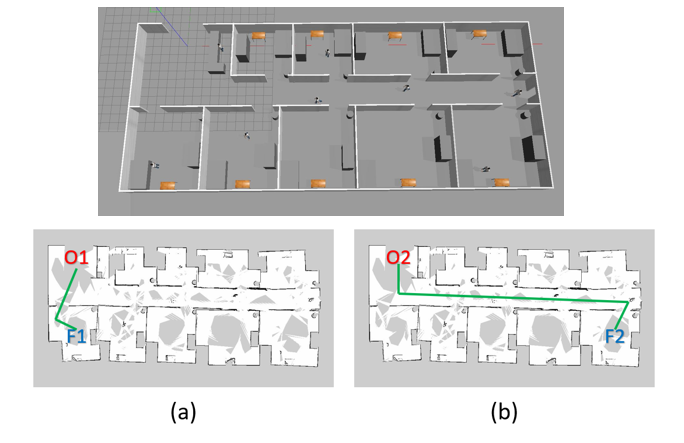
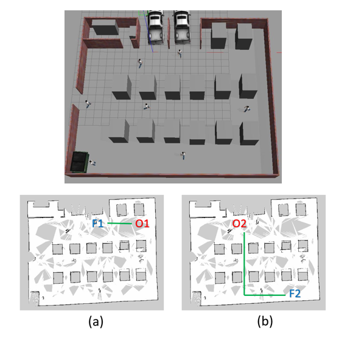
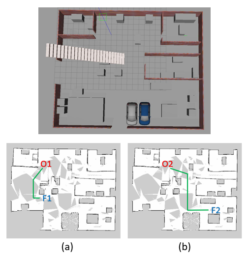
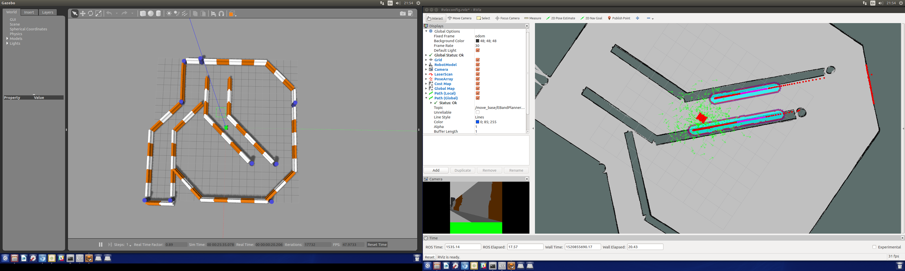
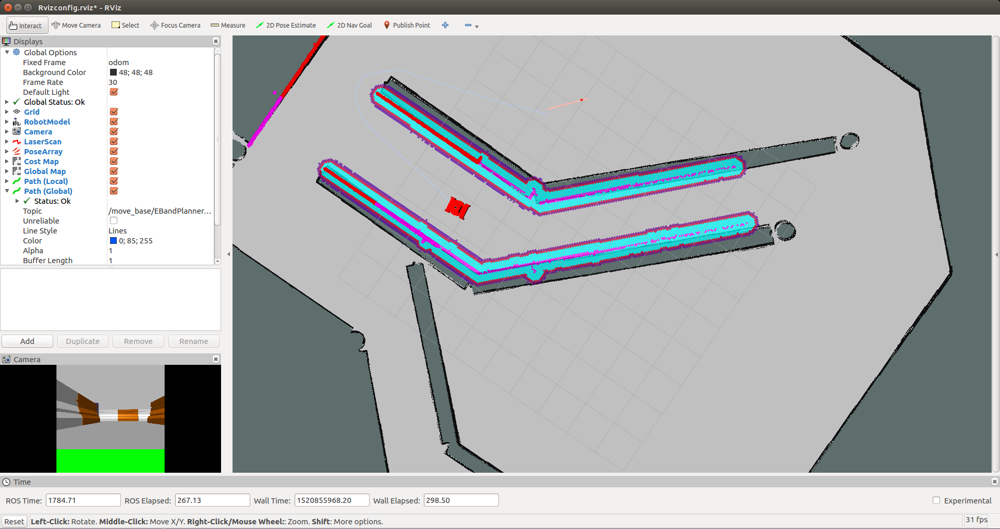
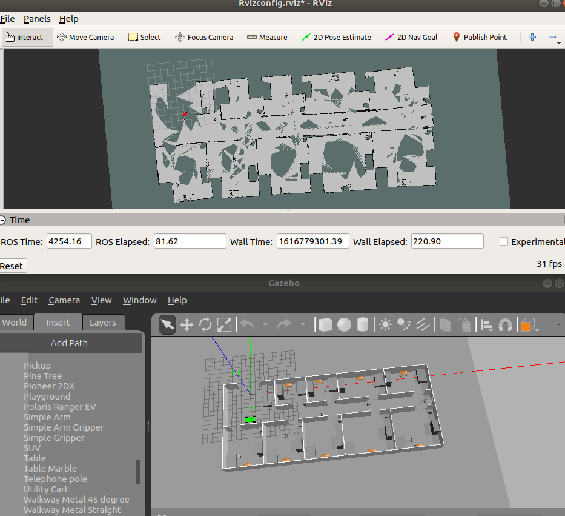

# ENGLISH

This repository contains a Robot Operating System (ROS) implementation of a four wheel robot model for uses with the ROS navigation stack.
This repository also contains three scenarios based in the areas in which service robots are most useful, being a hospital, a cellar and a laboratory.
The model uses the Adaptive Monte Carlo Localisation (AMCL) method for localisation and the local path planners named Elastic band (EB) and the Timed Elastic Band (TEB), so it can be done a comparison between those two algorithms in the three created scenarios.


## Prerequisites

1. [Ubuntu](https://www.ubuntu.com/) OS version 18.04.


2. Robot Operating System (ROS) version Melodic. Installation instructions can be found [here](http://wiki.ros.org/ROS/Installation).


3. Gazebo simulator. Istallation instructions for Ubuntu can be found [here](http://gazebosim.org/tutorials?tut=install_ubuntu). 

4. Gazebo ROS pkgs. Installation instructions can be found [here](http://gazebosim.org/tutorials?tut=ros_installing&cat=connect_ros).

5. Install ROS nodes required for the local and global planners, amcl, maps and motor control for the navigation stack.

```sh
$ sudo apt-get update
$ sudo apt-get install ros-melodic-move-base
$ sudo apt-get install ros-melodic-map-server
$ sudo apt-get install ros-melodic-amcl
$ sudo apt-get install ros-melodic-eband-local-planner
$ sudo apt-get install ros-melodic-teb-local-planner
$ sudo apt-get install ros-melodic-global-planner
```

## Installing

Clone this repository in your catkin workspace 'src/' folder.

```sh
$ cd ~/catkin_ws/src/
$ git clone https://github.com/Heych88/skid_steer_bot.git
```

Build the project:
```sh
$ cd ~/catkin_ws
$ catkin_make
```

If you haven’t already, the following line can be added to your .bashrc to auto-source all new terminals
```
source ~/catkin_ws/devel/setup.bash
```


## Change Scenario

To change the scenario that it is going to be use yo need to go to catkin_ws/src/skid_steer_bot/launch/udacity_world.launch and change the following line.
```sh
<arg name="world_name" value="$(find skid_steer_bot)/worlds/almacen_descarga.world"/>
```
using the name of the other existing scenarios, and save the changes.

It have to be change also the map it is going to be use. To change it yo need to go to catkin_ws/src/skid_steer_bot/launch/amcl.launch and change the following line.
```sh
<arg name="map_file" default="$(find skid_steer_bot)/maps/almacen_descarga.yaml"/>
```

using the name of the map of the used scenario.
 
## Change Local path Planner

## Change Goals

To change the goals yo need to go to catkin_ws/src/skid_steer_bot/src/app.py and change the following lines.
```sh
    goal.target_pose.pose.position.x =34.308149
    goal.target_pose.pose.position.y =-14.321036
```
You can chose between the following goals listed here below.
```sh
Hospital paths
-Simple paths
 x:-0.846702
 y:-14.261468
-Complex path
 x:34.308149
 y:-14.321036
```


```sh
Cellar paths
-Simple path
 x:-8.397526
 y:-0.175008
-Complex path
 x:10.028757
 y:-14.626811
```


```sh
Laboraty paths
-Simple path
 x:8.532881
 y:-1.884803
-Complex path
 x:11.557900
 y:10.099174
```


## Run the Code

In a terminal window, type the following,
```sh
$ cd ~/catkin_ws
$ roslaunch skid_steer_bot udacity_world.launch
```

In a new terminal, run the 'amcl.launch' file.
```sh
$ cd ~/catkin_ws
$ source devel/setup.bash
$ roslaunch skid_steer_bot amcl.launch
```

Gazebo and Rviz will load and you should arrive at a result similar to the below.

To measure the distance the robot travel during the path, in a new terminal, run the 'odom_movement_detector.py' file.
```sh
$ cd ~/catkin_ws
$ source devel/setup.bash
$ rosrun skid_steer_bot odom_movement_detector.py
```

then run the 'test_movement.py' file.
```sh
$ cd ~/catkin_ws
$ source devel/setup.bash
$ rosrun skid_steer_bot test_movement_.py
```

Finally to make the robot move to one of the stablished goals, in a new terminal, run the 'app.py' file.
```sh
$ cd ~/catkin_ws
$ source devel/setup.bash
$ rosrun skid_steer_bot app.py
```





###### Testing 

1. In Rviz, click on the 2D Nav Goal in the top menu. 
2. Click on the Rviz map where you want the robot to navigate too. 

You should arrive at a result similar to the below.



3. Also you can use the app.py to control the robot using the stablished goals and measuring the time that last the robot to get to the goal.

## Information

This project is based on an MIT project found [here](https://github.com/Heych88/skid_steer_bot).


# Español
Este repositorio contiene una implementacion utilizando el sistema operativo para robots (ROS por sus siglas en ingles) de un modelo de un robot de cuatro ruedas utilizando las librerias del navigation stack de ROS.
Este repositorio tambien contiene tres escenarios basados en areas en las cuales los robots de servicio son utilizados con mas frecuencia, siendo estos un hospital, un almacen y un laboratorio.
El modelo usa el algoritmo de localizacion de Monte Carlo Adaptativo (AMCL por sus siglas en ingles), el cual es un metodo de localizacion, y utiliza los planificadores de ruta local llamados banda elastica (EB por sus siglas en ingles) y banda elastica en el tiempo (TEB por sus siglas en ingles), para poder realizar comparaciones entre ambos algoritmos utilizando los tres escenarios creados. 


## Prerequisitos

1. [Ubuntu](https://www.ubuntu.com/) OS version 18.04.


2. Sistema Operativo para Robots (ROS por sus siglas en ingles) version Melodic. Las instrucciones para su instalacion pueden verse [aqui](http://wiki.ros.org/ROS/Installation).


3. Simulador Gazebo. Las instrucciones para su instalacion pueden verse [here](http://gazebosim.org/tutorials?tut=install_ubuntu). 

4. Gazebo ROS pkgs. Las instrucciones para su instalacion pueden verse [here](http://gazebosim.org/tutorials?tut=ros_installing&cat=connect_ros).

5. La instalacion de los nodos de ROS requeridos para los planificadores local y global, amcl, mapas y control de motor para el navigation stack.

```sh
$ sudo apt-get update
$ sudo apt-get install ros-melodic-move-base
$ sudo apt-get install ros-melodic-map-server
$ sudo apt-get install ros-melodic-amcl
$ sudo apt-get install ros-melodic-eband-local-planner
$ sudo apt-get install ros-melodic-teb-local-planner
$ sudo apt-get install ros-melodic-global-planner
```

## Instalacion

Clona este repositorio en tu espacio de trabajo llamado catkin 'src/' folder.

```sh
$ cd ~/catkin_ws/src/
$ git clone https://github.com/Heych88/skid_steer_bot.git
```

Crea el proyecto:
```sh
$ cd ~/catkin_ws
$ catkin_make
```

Si aun no lo has hecho, la siguiente linea de codigo puede ser añadida a .bashrc para auto-source todas las nuevas terminales.
```
source ~/catkin_ws/devel/setup.bash
```


## Cambiar escenario

Para cambiar el escenario que se va a utilizar es necesario ir a la carpeta catkin_ws/src/skid_steer_bot/launch/udacity_world.launch y cambiar la siguiente linea de codigo.
```sh
<arg name="world_name" value="$(find skid_steer_bot)/worlds/almacen_descarga.world"/>
```
Usando el nombre de otros escenarios existentes y guardando los cambios.

Tiene que ser cambiado tambien el mapa que se va a utilizar. Para cambiarlo es necesario ir a la carpeta catkin_ws/src/skid_steer_bot/launch/amcl.launch y cambiar la siguiente linea de codigo.
```sh
<arg name="map_file" default="$(find skid_steer_bot)/maps/almacen_descarga.yaml"/>
```

Usando el nombre de los mapas del escenario utilizado.
 
## Cambiar planificador de ruta local

## Cambiar metas

Para cambiar la meta es necesario ir a la carpeta catkin_ws/src/skid_steer_bot/src/app.py y cambiar las siguientes lineas de codigo.
```sh
    goal.target_pose.pose.position.x =34.308149
    goal.target_pose.pose.position.y =-14.321036
```
Se puede elegir entre las siguientes metas que se enlistan abajo.
```sh
Rutas del hospital
-Simple paths
 x:-0.846702
 y:-14.261468
-Complex path
 x:34.308149
 y:-14.321036
```


```sh
Rutas del almacen
-Simple path
 x:-8.397526
 y:-0.175008
-Complex path
 x:10.028757
 y:-14.626811
```


```sh
Rutas del laboratorio
-Simple path
 x:8.532881
 y:-1.884803
-Complex path
 x:11.557900
 y:10.099174
```


## Iniciar el codigo

En una terminal escribe lo siguiente,
```sh
$ cd ~/catkin_ws
$ roslaunch skid_steer_bot udacity_world.launch
```

En una nueva terminal corre el archivo 'amcl.launch'.
```sh
$ cd ~/catkin_ws
$ source devel/setup.bash
$ roslaunch skid_steer_bot amcl.launch
```

Gazebo y Rviz cargaran y se vera un resultado similar como el aue se muestra a continuacion.

Para medir la distancia que el robot hace durante la ruta, en una nueva terminal, inicia el archivo 'odom_movement_detector.py'.
```sh
$ cd ~/catkin_ws
$ source devel/setup.bash
$ rosrun skid_steer_bot odom_movement_detector.py
```

Despues inicia el archivo 'test_movement.py'.
```sh
$ cd ~/catkin_ws
$ source devel/setup.bash
$ rosrun skid_steer_bot test_movement_.py
```

Finalmente para hacer que el robot inicie movimiento a una de la smetas establecidas, en una nueva terminal, inicia el archivo 'app.py'.
```sh
$ cd ~/catkin_ws
$ source devel/setup.bash
$ rosrun skid_steer_bot app.py
```





###### Probando 

1. En Rviz, pulsa en 2D Nav Goal en la parte superior del menu. 
2. Pulsa tambien en el mapa de Rviz hacia donde se quiera que el robot se dirija. 

Se debe ver un resultado similar al de abajo.


3. Tambien se puede utilizar el archivo app.py para controlar el robot utilizando las metas establecidas y midiendo el tiempo que el robot tarda en realizar la ruta completa.

## Informacion

Este proyecto esta basado en un proyecto realizado por el MIT el cual puede encontralo [aqui](https://github.com/Heych88/skid_steer_bot).

